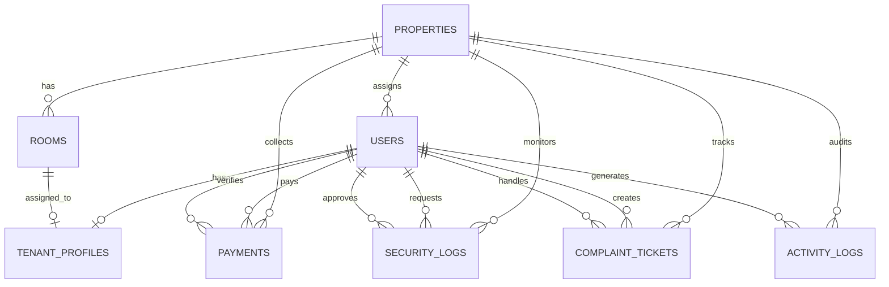

<div align="center">

# Manggon

**Platform Manajemen Kos Putri Multi-Lokasi, Aman, dan Transparan**

[](https://laravel.com)
[](https://www.php.net)
[](https://www.postgresql.org)
[](https://inertiajs.com)
[](https://react.dev)
[](https://www.typescriptlang.org)
[](https://tailwindcss.com)
[](https://reactnative.dev)
[](https://pestphp.com)

<br />

*"Menjembatani kenyamanan anak kos putri, kedisiplinan staf penjaga, dan transparansi finansial pemilik kos multi-cabang."*

</div>

---

## Daftar Isi
1. [Tentang Manggon](#tentang-manggon)
2. [Fitur Utama & Matriks Hak Akses](#fitur-utama--matriks-hak-akses)
3. [Arsitektur & Tech Stack](#arsitektur--tech-stack)
4. [Skema Basis Data](#skema-basis-data)
5. [Prinsip Keamanan & Desain](#prinsip-keamanan--desain)
6. [Panduan Instalasi & Penggunaan Lokal](#panduan-instalasi--penggunaan-lokal)
7. [Kredensial Akun Percobaan (Seed Data)](#kredensial-akun-percobaan-seed-data)
8. [Pengujian & Verifikasi](#pengujian--verifikasi)

---

## Tentang Manggon

**Manggon** adalah sistem manajemen properti kos putri terpadu yang dirancang khusus untuk menangani operasional multi-cabang secara tersentralisasi. Sistem ini memecahkan tantangan operasional klasik seperti:
* **Risiko Fraud Keuangan:** Pembatasan mutlak pembuatan dan pengubahan nominal tagihan hanya oleh Pemilik (*Owner*), disertai audit trail staf verifikator.
* **Keamanan & Ketertiban Jam Malam:** Digitalisasi izin pulang larut malam dan buku tamu perempuan secara terdata dan terverifikasi staf.
* **Respons Keluhan Fasilitas:** Sistem tiket perbaikan fasilitas kamar (AC, air, listrik) dengan pemantauan status pengerjaan transparan.
* **Akun Otomatis:** Otomatisasi pembuatan kredensial staf dan anak kos tanpa kerumitan administrasi manual.

---

## Fitur Utama & Matriks Hak Akses

| Hak Akses | Platform | Fitur Utama | Batasan & Aturan Keamanan |
| :--- | :--- | :--- | :--- |
| **Owner (Superadmin)** | Web Dashboard | • Manajemen CRUD multi-properti & kamar<br>• Kontrol finansial mutlak (buat tagihan, edit tarif, hapus pembayaran)<br>• Generate kredensial staf & tenant<br>• Audit trail polymorphic untuk memantau aktivitas sistem | Akses tanpa batas ke seluruh cabang dan data keuangan |
| **Staff (Penjaga Cabang)** | Web Dashboard | • *Action Center / Inbox-Zero UI*<br>• Validasi bukti bayar transfer sewa<br>• Verifikasi izin pulang malam & tamu menginap<br>• Disposisi dan penanganan tiket keluhan | • **Data Scoping:** Terkunci ketat hanya pada cabang (`property_id`) penugasannya<br>• Dilarang membuat anak kos, mengubah nominal tagihan, atau menghapus data |
| **Tenant (Anak Kos Putri)** | Mobile App | • Formulir Satpam Digital (izin pulang malam & tamu wanita)<br>• Unggah bukti transfer sewa mandiri<br>• Pelaporan kerusakan fasilitas kamar dengan bukti foto<br>• Pembaruan profil & kontak darurat | • Wajib ubah kata sandi pada login pertama (*Force Password Change*)<br>• Hanya dapat mengakses data pribadi dan kamarnya |

---

## Arsitektur & Tech Stack

Manggon dibangun menggunakan arsitektur **Monolithic Backend + Clean SPA + Headless Mobile API**:

* **Backend Core:** [Laravel 12](https://laravel.com) (PHP 8.2+) dengan arsitektur modular, Form Requests, Policies, dan Service Layer.
* **Basis Data:** [PostgreSQL 16](https://www.postgresql.org) dengan relasi berindeks, *foreign keys*, dan JSONB casting.
* **Client Frontend (Web):** [React 19](https://react.dev) + [Inertia.js v2](https://inertiajs.com) + [TypeScript](https://www.typescriptlang.org) (*Strict Mode*, bebas tipe `any`).
* **Styling & Motion:** [Tailwind CSS v4](https://tailwindcss.com) + [Radix UI](https://www.radix-ui.com) + Lucide Icons dengan estetika *Clean Minimalist* (Aksen *Ocean Blue* & *Sage Green*).
* **Mobile Client:** [React Native](https://reactnative.dev) didukung REST API Laravel Sanctum untuk portal anak kos.
* **Automated Testing:** [Pest PHP 3](https://pestphp.com) & PHPUnit untuk pengujian integrasi database dan model domain.

---

## Skema Basis Data

Sistem memiliki 8 entitas utama yang saling terhubung:



### Backed Enums Domain (PHP 8.2)
* **`UserRole`:** `owner`, `staff`, `tenant`
* **`RoomStatus`:** `empty`, `occupied`, `maintenance`
* **`PaymentStatus`:** `unpaid`, `pending_verification`, `paid`, `rejected`
* **`SecurityLogType`:** `late_return`, `guest_visit`
* **`SecurityLogStatus`:** `pending`, `approved`, `rejected`
* **`ComplaintStatus`:** `pending`, `in_progress`, `resolved`, `rejected`

---

## Prinsip Keamanan & Desain

1. **Strict Data Scoping Policy:**
   Staf cabang diproteksi melalui Laravel Policy `auth()->user()->property_id === $target->property_id`. Staf tidak memiliki akses baca/tulis ke cabang lain.
2. **Standardisasi Kredensial Otomatis:**
   * Format staf: Nama depan + 4 digit akhir nomor telepon (contoh: `siti7891`).
   * Format tenant: Kombinasi kamus kata + nomor kamar (contoh: `panda_a01`, `ceri_a02`).
   * Seluruh username berformat **huruf kecil (*lowercase*)**.
3. **First-Login Enforcement:**
   Akun yang memiliki `must_change_password = true` dicegat oleh middleware hingga melakukan pembaruan kata sandi di rute `/password/update`.
4. **Audit Trail Polymorphic:**
   Setiap tindakan kritis (validasi pembayaran, persetujuan izin, perubahan status kamar) tercatat dalam tabel `activity_logs` lengkap dengan snapshot data lama vs baru, IP address, dan user agent.

---

## Panduan Instalasi & Penggunaan Lokal

### Prasyarat Sistem
* PHP >= 8.2 dengan ekstensi `pdo_pgsql`, `mbstring`, `openssl`
* Composer 2.x
* Node.js >= 20.x & npm
* PostgreSQL Server (versi 15 atau 16)

### Langkah Instalasi

1. **Clone repositori:**
   ```bash
   git clone https://github.com/abimanyupewe/manggon.git
   cd manggon
   ```

2. **Install dependensi PHP & JavaScript:**
   ```bash
   composer install
   npm install
   ```

3. **Konfigurasi Environment (.env):**
   Salin `.env.example` dan sesuaikan koneksi database PostgreSQL:
   ```bash
   cp .env.example .env
   php artisan key:generate
   ```
   Pastikan pengaturan database pada `.env`:
   ```env
   DB_CONNECTION=pgsql
   DB_HOST=127.0.0.1
   DB_PORT=5432
   DB_DATABASE=manggon
   DB_USERNAME=postgres
   DB_PASSWORD=your_password
   ```

4. **Eksekusi Migrasi & Seeder Data:**
   ```bash
   php artisan migrate:fresh --seed
   ```

5. **Jalankan Aplikasi:**
   ```bash
   npm run dev
   # dan di terminal terpisah:
   php artisan serve
   ```
   Aplikasi dapat diakses melalui browser di `http://localhost:8000`.

---

## Kredensial Akun Percobaan (Seed Data)

Database seeder telah menyiapkan data sampel multi-cabang (Cabang Melati Dukuh Kupang & Cabang Anggrek Gubeng) dengan kata sandi bawaan **`password123`**:

| Peran (*Role*) | Nama Pengguna (*Username*) | Email | Keterangan |
| :--- | :--- | :--- | :--- |
| **Owner** | `owner_manggon` | `owner@manggon.id` | Akses penuh superadmin seluruh cabang |
| **Staf Melati** | `siti7891` | `siti@manggon.id` | Penjaga Kos Cabang Melati (Surabaya Barat) |
| **Staf Anggrek** | `dewi7892` | `dewi@manggon.id` | Penjaga Kos Cabang Anggrek (Surabaya Timur) |
| **Tenant A01** | `panda_a01` | `putriayu@gmail.com` | Kamar A01 Cabang Melati (Status: Lunas) |
| **Tenant A02** | `ceri_a02` | `nabila@gmail.com` | Kamar A02 Cabang Melati (*Wajib Ganti Password*) |
| **Tenant B01** | `mangga_b01` | `zahra@gmail.com` | Kamar B01 Cabang Anggrek (Status: Verifikasi Bukti) |

---

## Pengujian & Verifikasi

Proyek ini dilengkapi dengan suite pengujian otomatis untuk memvalidasi integritas relasi model, hak akses, dan kepatuhan tipe:

```bash
# Menjalankan unit & feature testing Laravel
php artisan test --filter=ManggonFoundationTest

# Menjalankan validasi ketat TypeScript (0 Errors)
npx tsc --noEmit
```

---

<div align="center">
  <small>© 2026 Manggon - Sistem Manajemen Kos Putri Terpadu. All rights reserved.</small>
</div>
