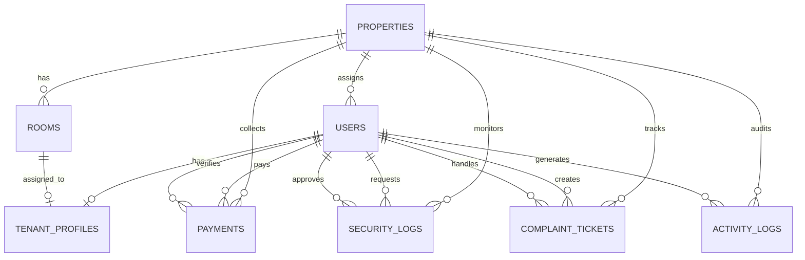

<div align="center">

# Manggon

**Platform Manajemen Kos Putri Multi-Lokasi, Aman, dan Transparan**

[](https://laravel.com)
[](https://www.php.net)
[](https://www.postgresql.org)
[](https://inertiajs.com)
[](https://react.dev)
[](https://www.typescriptlang.org)
[](https://tailwindcss.com)
[](https://reactnative.dev)
[](https://pestphp.com)

<br />

*"Menjembatani kenyamanan anak kos putri, kedisiplinan staf penjaga, dan transparansi finansial pemilik kos multi-cabang."*

</div>

---

## Tentang Manggon

**Manggon** adalah platform manajemen properti terpadu tingkat enterprise yang dirancang khusus untuk menangani operasional kos putri multi-cabang secara tersentralisasi. Sistem ini menghubungkan tiga pihak pemangku kepentingan utama: **Pemilik Kos (Owner)** yang membutuhkan transparansi finansial menyeluruh, **Penjaga Kos (Staf)** yang menjalankan operasional harian cabang secara tertib, dan **Anak Kos Putri (Tenant)** yang mengutamakan privasi, kenyamanan, serta kemudahan layanan hunian.

---

## Problem yang Diselesaikan

Dalam operasional bisnis kos putri tradisional dengan banyak lokasi cabang, pemilik dan pengelola kerap menghadapi tantangan struktural yang berulang. Platform Manggon dirancang untuk memecahkan lima masalah fundamental berikut:

### 1. Risiko Fraud dan Kebocoran Finansial (Financial Leakage)
* **Problem:** Pada pengelolaan konvensional, pembayaran sewa sering diterima secara tunai oleh penjaga cabang atau dicatat secara manual di spreadsheet. Hal ini menciptakan celah penggelapan dana sewa, manipulasi status pelunasan, atau mark-up tarif sewa kamar tanpa sepengetahuan pemilik yang tidak selalu berada di lokasi.
* **Solusi Manggon:** Penerapan **Kontrol Finansial Mutlak (Owner-Only Financial Governance)**. Hanya Pemilik yang memiliki hak otorisasi untuk menerbitkan invoice tagihan baru, menentukan nominal harga sewa, mengedit rincian tagihan, atau menghapus transaksi. Staf penjaga dibatasi hak aksesnya (*restricted access*) hanya untuk memverifikasi kesesuaian bukti transfer bank yang diunggah anak kos. Setiap verifikasi, persetujuan, atau penolakan dicatat secara otomatis ke dalam rekam jejak audit (*audit trail polymorphic*) lengkap dengan timestamp, IP address, dan identitas staf verifikator.

### 2. Penegakan Disiplin Jam Malam dan Keamanan Kos Putri
* **Problem:** Kos putri memiliki regulasi privasi dan keamanan ketat, seperti batasan jam malam, pelarangan tamu pria masuk ke area kamar, dan kewajiban pelaporan jika ada kerabat perempuan menginap. Pencatatan menggunakan buku tamu fisik sering kali diabaikan oleh anak kos karena enggan melapor tatap muka saat larut malam, atau bukunya mudah hilang dan tidak terpantau oleh pemilik.
* **Solusi Manggon:** Modul **Satpam Digital**. Anak kos dapat mengajukan permohonan izin pulang larut malam atau pendaftaran kunjungan tamu wanita secara mandiri langsung dari aplikasi ponsel. Formulir mencakup jam rencana kedatangan, identitas tamu, dan alasan perizinan. Staf penjaga menerima notifikasi langsung di dashboard Action Center untuk menyetujui atau menolak permohonan tersebut, menciptakan arsip keamanan yang rapi, transparan, dan dapat diaudit sewaktu-waktu.

### 3. Lambatnya Respons Perbaikan Fasilitas Kamar
* **Problem:** Laporan kerusakan fasilitas penting (seperti AC bocor, kran air patah, water heater rusak, atau korsleting listrik) biasanya dikirim melalui pesan chat pribadi ke penjaga. Pesan tersebut rawan tertimbun, terlambat diteruskan ke teknisi, atau status perbaikannya tidak pernah terkonfirmasi kembali ke anak kos, sehingga menurunkan tingkat kepuasan dan retensi penghuni.
* **Solusi Manggon:** **Sistem Tiket Keluhan Terintegrasi (Complaint Ticket Tracking)**. Anak kos menerbitkan tiket keluhan resmi dari aplikasi mobile lengkap dengan deskripsi detail dan lampiran foto bukti kerusakan. Tiket memiliki nomor registrasi unik (`TKT-YYYYMM-XXX`) dan langsung masuk ke antrean tugas staf cabang terkait. Seluruh proses pengerjaan (status `pending` -> `in_progress` -> `resolved`) beserta catatan penanganan teknisi dapat dipantau langsung secara real-time oleh anak kos dan pemilik kos.

### 4. Fragmentasi Data dan Kesulitan Pengawasan Multi-Cabang
* **Problem:** Mengelola beberapa cabang kos di lokasi geografis yang berbeda menimbulkan kesulitan pemantauan okupansi kamar, status keterisian, dan performa staf jaga secara terpusat. Di sisi lain, sistem tanpa isolasi data yang ketat berisiko menimbulkan kesalahan operasional antar cabang.
* **Solusi Manggon:** **Strict Data Scoping & Role-Based Access Control (RBAC)**. Pemilik kos memiliki dashboard eksekutif untuk memantau performa agregat seluruh cabang (tingkat okupansi, pendapatan berjalan, audit aktivitas staf). Sementara itu, staf penjaga dikunci secara ketat berdasarkan cabang penugasannya (`property_id`), sehingga hanya dapat melihat dan memproses data di cabangnya sendiri melalui antarmuka tugas harian bergaya *Inbox-Zero Action Center*.

### 5. Kerumitan Administrasi Akun dan Keamanan Kata Sandi
* **Problem:** Pendaftaran kredensial anak kos dan staf baru secara manual memakan waktu, rawan kesalahan penulisan, dan sering kali menggunakan kata sandi lemah yang tidak pernah diperbarui.
* **Solusi Manggon:** **Automated Credential Generation & First-Login Force Password Change**. Sistem secara otomatis menghasilkan username terstandarisasi berbasis kombinasi unik huruf kecil (*strict lowercase*) dan password acak. Saat anak kos atau staf login untuk pertama kali, middleware sistem mencegat sesi dan mewajibkan penggantian kata sandi baru yang kuat sebelum fitur dashboard atau aplikasi dapat diakses.

---

## Fitur Utama & Matriks Hak Akses

| Hak Akses | Platform | Fitur Utama | Batasan & Aturan Keamanan |
| :--- | :--- | :--- | :--- |
| **Owner (Superadmin)** | Web Dashboard | • Manajemen CRUD multi-properti & kamar<br>• Kontrol finansial mutlak (buat tagihan, edit tarif, hapus pembayaran)<br>• Generate kredensial staf & tenant<br>• Audit trail polymorphic untuk memantau aktivitas sistem | Akses tanpa batas ke seluruh cabang dan data keuangan |
| **Staff (Penjaga Cabang)** | Web Dashboard | • *Action Center / Inbox-Zero UI*<br>• Validasi bukti bayar transfer sewa<br>• Verifikasi izin pulang malam & tamu menginap<br>• Disposisi dan penanganan tiket keluhan | • **Data Scoping:** Terkunci ketat hanya pada cabang (`property_id`) penugasannya<br>• Dilarang membuat anak kos, mengubah nominal tagihan, atau menghapus data |
| **Tenant (Anak Kos Putri)** | Mobile App | • Formulir Satpam Digital (izin pulang malam & tamu wanita)<br>• Unggah bukti transfer sewa mandiri<br>• Pelaporan kerusakan fasilitas kamar dengan bukti foto<br>• Pembaruan profil & kontak darurat | • Wajib ubah kata sandi pada login pertama (*Force Password Change*)<br>• Hanya dapat mengakses data pribadi dan kamarnya |

---

## Arsitektur & Tech Stack

Manggon dibangun menggunakan arsitektur **Monolithic Backend + Clean SPA + Headless Mobile API**:

* **Backend Core:** [Laravel 12](https://laravel.com) (PHP 8.2+) dengan arsitektur modular, Form Requests, Policies, dan Service Layer.
* **Basis Data:** [PostgreSQL 16](https://www.postgresql.org) dengan relasi berindeks, *foreign keys*, dan JSONB casting.
* **Client Frontend (Web):** [React 19](https://react.dev) + [Inertia.js v2](https://inertiajs.com) + [TypeScript](https://www.typescriptlang.org) (*Strict Mode*, bebas tipe `any`).
* **Styling & Motion:** [Tailwind CSS v4](https://tailwindcss.com) + [Radix UI](https://www.radix-ui.com) + Lucide Icons dengan estetika *Clean Minimalist* (Aksen *Ocean Blue* & *Sage Green*).
* **Mobile Client:** [React Native](https://reactnative.dev) didukung REST API Laravel Sanctum untuk portal anak kos.
* **Automated Testing:** [Pest PHP 3](https://pestphp.com) & PHPUnit untuk pengujian integrasi database dan model domain.

---

## Skema Basis Data

Sistem memiliki 8 entitas utama yang saling terhubung:



### Backed Enums Domain (PHP 8.2)
* **`UserRole`:** `owner`, `staff`, `tenant`
* **`RoomStatus`:** `empty`, `occupied`, `maintenance`
* **`PaymentStatus`:** `unpaid`, `pending_verification`, `paid`, `rejected`
* **`SecurityLogType`:** `late_return`, `guest_visit`
* **`SecurityLogStatus`:** `pending`, `approved`, `rejected`
* **`ComplaintStatus`:** `pending`, `in_progress`, `resolved`, `rejected`

---

## Prinsip Keamanan & Desain

1. **Strict Data Scoping Policy:**
   Staf cabang diproteksi melalui Laravel Policy `auth()->user()->property_id === $target->property_id`. Staf tidak memiliki akses baca/tulis ke cabang lain.
2. **Standardisasi Kredensial Otomatis:**
   * Format staf: Nama depan + 4 digit akhir nomor telepon (contoh: `siti7891`).
   * Format tenant: Kombinasi kamus kata + nomor kamar (contoh: `panda_a01`, `ceri_a02`).
   * Seluruh username berformat **huruf kecil (*lowercase*)**.
3. **First-Login Enforcement:**
   Akun yang memiliki `must_change_password = true` dicegat oleh middleware hingga melakukan pembaruan kata sandi di rute `/password/update`.
4. **Audit Trail Polymorphic:**
   Setiap tindakan kritis (validasi pembayaran, persetujuan izin, perubahan status kamar) tercatat dalam tabel `activity_logs` lengkap dengan snapshot data lama vs baru, IP address, dan user agent.

---

## Panduan Instalasi & Penggunaan Lokal

### Prasyarat Sistem
* PHP >= 8.2 dengan ekstensi `pdo_pgsql`, `mbstring`, `openssl`
* Composer 2.x
* Node.js >= 20.x & npm
* PostgreSQL Server (versi 15 atau 16)

### Langkah Instalasi

1. **Clone repositori:**
   ```bash
   git clone https://github.com/abimanyupewe/manggon.git
   cd manggon
   ```

2. **Install dependensi PHP & JavaScript:**
   ```bash
   composer install
   npm install
   ```

3. **Konfigurasi Environment (.env):**
   Salin `.env.example` dan sesuaikan koneksi database PostgreSQL:
   ```bash
   cp .env.example .env
   php artisan key:generate
   ```
   Pastikan pengaturan database pada `.env`:
   ```env
   DB_CONNECTION=pgsql
   DB_HOST=127.0.0.1
   DB_PORT=5432
   DB_DATABASE=manggon
   DB_USERNAME=postgres
   DB_PASSWORD=your_password
   ```

4. **Eksekusi Migrasi & Seeder Data:**
   ```bash
   php artisan migrate:fresh --seed
   ```

5. **Jalankan Aplikasi:**
   ```bash
   npm run dev
   # dan di terminal terpisah:
   php artisan serve
   ```
   Aplikasi dapat diakses melalui browser di `http://localhost:8000`.

---

## Kredensial Akun Percobaan (Seed Data)

Database seeder telah menyiapkan data sampel multi-cabang (Cabang Melati Dukuh Kupang & Cabang Anggrek Gubeng) dengan kata sandi bawaan **`password123`**:

| Peran (*Role*) | Nama Pengguna (*Username*) | Email | Keterangan |
| :--- | :--- | :--- | :--- |
| **Owner** | `owner_manggon` | `owner@manggon.id` | Akses penuh superadmin seluruh cabang |
| **Staf Melati** | `siti7891` | `siti@manggon.id` | Penjaga Kos Cabang Melati (Surabaya Barat) |
| **Staf Anggrek** | `dewi7892` | `dewi@manggon.id` | Penjaga Kos Cabang Anggrek (Surabaya Timur) |
| **Tenant A01** | `panda_a01` | `putriayu@gmail.com` | Kamar A01 Cabang Melati (Status: Lunas) |
| **Tenant A02** | `ceri_a02` | `nabila@gmail.com` | Kamar A02 Cabang Melati (*Wajib Ganti Password*) |
| **Tenant B01** | `mangga_b01` | `zahra@gmail.com` | Kamar B01 Cabang Anggrek (Status: Verifikasi Bukti) |

---

## Pengujian & Verifikasi

Proyek ini dilengkapi dengan suite pengujian otomatis untuk memvalidasi integritas relasi model, hak akses, dan kepatuhan tipe:

```bash
# Menjalankan unit & feature testing Laravel
php artisan test --filter=ManggonFoundationTest

# Menjalankan validasi ketat TypeScript (0 Errors)
npx tsc --noEmit
```

---

<div align="center">
  <small>© 2026 Manggon - Sistem Manajemen Kos Putri Terpadu. All rights reserved.</small>
</div>
